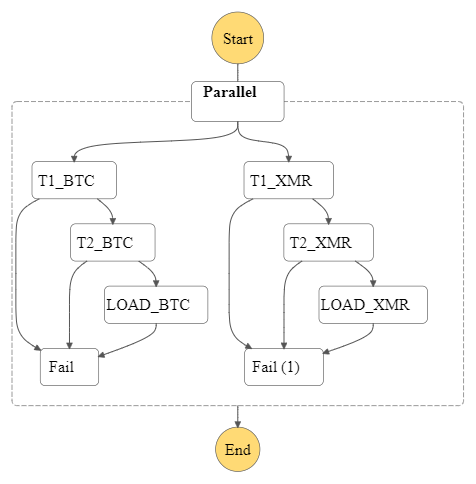

# AWS_DataEng

Esempio di come costruire due Pipeline in parallelo con Glue ETL (una per dataset su Bitcoin e una su Monero), da file situati in bucket S3 , e dopo pulizie e trasformazione caricarli su Redshift e poter eventualmente chiamare Api per avere i dati in locale per fare analisi .

